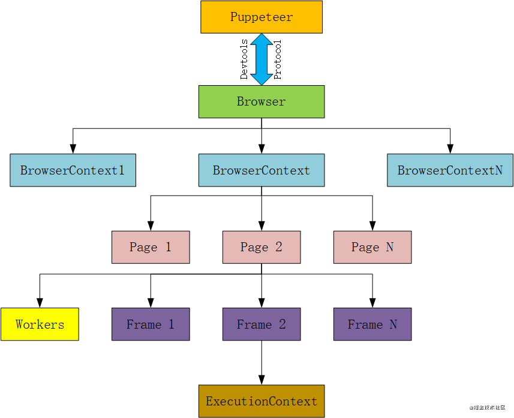

## 前言

页面交互一直是前端最为重要的组成部分，可要实现其 UI 层次的自动化测试一直是老大难的问题。过去，我们通常都是人工去点击页面，测试页面交互、数据传输。因此，E2E 测试应需而生，E2E 测试极为便捷的解决了用户层面的交互测试。

## Puppeteer

Puppeteer 中文直译：傀儡师。正如其名，Puppeteer 是一个 Node 库，它提供了一个许多高级 API 来通过 DevTools 协议控制 Chromium 或 Chrome。
Puppeteer API 是分层次的，反映了浏览器结构。



- Browser：是一个浏览器实例，可以拥有浏览器上下文，可通过 puppeteer.launch 或 puppeteer.connect 创建一个 Browser 对象。
- BrowserContext：该实例定义了一个浏览器上下文，可拥有多个页面，创建浏览器实例时默认会创建一个浏览器上下文（不能关闭），此外可以利用 browser.createIncognitoBrowserContext() 创建一个匿名的浏览器上下文（不会与其它浏览器上下文共享cookie/cache）.
- Page：至少包含一个主框架，除了主框架外还有可能存在其它框架，例如 iframe。
- Frame：页面中的框架，在每个时间点，页面通过page.mainFrame()和frame.childFrames()方法暴露当前框架的细节。对于该框架中至少有一个执行上下文
- ExecutionCOntext：表示一个JavaScript的执行上下文。
- Worker：具有单个执行上下文，便于与 WebWorkers 交互。

### What can puppeteer do?
*   生成页面的屏幕截图和PDF。
*   抓取SPA并生成预渲染内容（即“SSR”）。
*   自动表单提交，UI测试，键盘输入等。
*   创建最新的自动化测试环境。 使用最新的JavaScript和浏览器功能直接在最新版本的Chrome中运行测试。
*   捕获您网站的[时间线跟踪]
*   实现简单的爬虫
### Why choose puppeteer ?

| 框架或库               |                         Description                          | 跨浏览器 | 自动生成代码 | 社区活跃 | 核心原理                                                     |
| ---------------------- | :----------------------------------------------------------: | :------: | ------------ | -------- | ------------------------------------------------------------ |
| PhantomJS [star 28.5k] |       一个基于 webkit 内核的无头浏览器，没有 UI 界面。       |    No    | No           | Yes      | 基于 webkit 内核的无头浏览器                                 |
| Nightwatch [str 10.8k] |    Node.js 调用 Webdriver API 实现的端到端(e2e)测试框架。    |   Yes    | No           | No       | webdriver                                                    |
| Puppeteer [star 72.2k] | Puppeteer 是一个提供建立在 DevTools 协议（[devtools-protocol](https://chromedevtools.github.io/devtools-protocol/)），控制 Chrome 或 Chromium 的高阶 API node 库。 |    No    | Yes          | Yes      | [ChromeDevTools协议](https://chromedevtools.github.io/devtools-protocol/) |
| Selenium [star 21.2k]  | Selenium 是一个浏览器自动化测试库。支持多语言编写，Selenium 可以用来做任何需要和浏览器交互的任务。Selenium IDE 在2018年官方已宣告放弃维护了。官网上放着一句话，selenium IDE is Dead。 |   Yes    | No           | No       | webdriver                                                    |

Nightwatch、Selenium均属于 webdriver 类型。

webdriver 直接操作浏览器页面里的元素，甚至操作浏览器本身（截屏，窗口大小，启动，关闭，安装插件，配置证书之类的）。由于使用的是浏览器原生的API，速度大大提高，只要浏览器支持 webdriver 就可以实现。PhantomJS，就是一个无头浏览器，我理解无头浏览器，在我们开发 E2E 测试过程中是不可视化的。

Puppeteer 建立在 ChromeDevTools 协议上。以下是官方原话：

The **Chrome DevTools Protocol** allows for tools to instrument, inspect, debug and profile Chromium, Chrome and other Blink-based browsers. Many existing projects [currently use](https://github.com/ChromeDevTools/awesome-chrome-devtools) the protocol. The [Chrome DevTools](https://developers.google.com/web/tools/chrome-devtools/) uses this protocol and the team maintains its API. Instrumentation is divided into a number of domains (DOM, Debugger, Network etc.). Each domain defines a number of commands it supports and events it generates. Both commands and events are serialized JSON objects of a fixed structure.

ChromeDevTools 协议允许工具对 Chrome 和 other Blink-based browsers 进行检查、调试和配置。Chrome 开发工具使用这个协议，团队维护它的API。工具可以分为多个域包括 DOM、调试器、网络等。每个域定义了它支持的许多命令和它生成的事件。命令和事件都是固定结构的序列化 JSON 对象。

综上，Puppeteer 背后有 google 爸爸，star 最高，社区活跃，自有谷歌扩展 handless recorder 和测试平台，支持自动化生成测试代码及在线测试，使开发更快捷。假如需要跨浏览器开发，考虑兼容性，则使用 Nightwatch

[搞懂webdriver的底层原理]: https://baijiahao.baidu.com/s?id=1628782259102304673&amp;wfr=spider&amp;for=pc
[Chrome DevTools Protocol]: https://chromedevtools.github.io/devtools-protocol/

### Handleless Recorder

Handleless Recorder 是一个 Chrome 扩展程序，可记录您的浏览器交互并生成 Puppeteer 脚本。手动编写 E2E 测试一直是一个老大难的问题，而借助 Handleless recorder 这个扩展程序可以很大程度上的帮助我们编写 E2E 测试。简单的说，Handleless recorder 可以帮助你记录在 Chrome 浏览器上执行的操作，并生成 Punppeter 代码。实现“一次操作，生成测试”，极大的缩短了我们书写 E2E 测试的时间，减少手写测试代码的代码量，解放我们的双手。让写 E2E 测试不再烦恼。

[Handleless Recorder]: https://chrome.google.com/webstore/detail/headless-recorder/djeegiggegleadkkbgopoonhjimgehda?hl=zh-CN

### How to use puppeteer ?

#### 安装依赖

新建 node 项目下执行指令：

> npm install puppeteer --save
#### 按需引入

> const  puppeteer  =  require('puppeteer')
### 基本使用和常用功能

> 该神器整体使用起来比较简单，下面就开始我们的使用之路。

#### 启动Browser

> 核心函数就是异步调用 `puppeteer.launch()` 函数，根据相应的配置参数创建一个 Browser 实例。

```javascript
;(async () => {
    const path = require('path');
    const puppeteer = require('puppeteer');

    const chromiumPath = path.join(__dirname, '../', 'chromium/chromium/chrome.exe');
    // 启动chrome浏览器
    const browser = await puppeteer.launch({
        // 指定该浏览器的路径
        executablePath: chromiumPath,
        // 是否为无头浏览器模式，默认为无头浏览器模式
        headless: false
    });
})()
```

#### 访问页面

> 访问页面首先需要创建一个浏览器上下文，然后基于该上下文创建一个新的page，最后指定要访问的网址。

```javascript
;(async () => {
  const puppeteer = require('puppeteer')
  const browser = await puppeteer.launch({
    //设置有头模式（默认为true，无头模式）
    headless: false,
  })

  // 在一个默认的浏览器上下文中被创建一个新页面
  const page1 = await browser.newPage()

  // 空白页访问问该指定网址
  await page1.goto('https://www.baidu.com')

  // navigationPromise 常用于等待跳转结束
  const navigationPromise = page1.waitForNavigation()
  await navigationPromise

  // 创建一个匿名的浏览器上下文
  const browserContext = await browser.createIncognitoBrowserContext()

  // 在该上下文中创建一个新页面
  const page2 = await browserContext.newPage()
  page2.goto('https://www.bilibili.com/')
})()
```

页面常用的操作

1. page.goto(url, options)
2. page.goBack(options)
3. page.goForward(options)
4. page.reload(options)
5. browser.createIncognitoBrowserContext() 

#### 设备模拟

> 经常需要不同类型的机型的浏览结果，此时就可以采用设备模拟实现，下面模拟一个 iPhone X 设备的浏览器结果

```javascript
;(async () => {
  const puppeteer = require('puppeteer')
  // 启动chrome浏览器
  const browser = await puppeteer.launch({
    // 是否为无头浏览器模式，默认为无头浏览器模式
    headless: false,
  })

  const page = await browser.newPage()

  // 设备模拟：模拟一个iPhone X
  // user agent
  await page.setUserAgent(
    'Mozilla/5.0 (iPhone; CPU iPhone OS 11_0 like Mac OS X) AppleWebKit/604.1.38 (KHTML, like Gecko) Version/11.0 Mobile/15A372 Safari/604.1'
  )

  // 视口（viewport）模拟
  await page.setViewport({ width: 375, height: 812 })

  // makeLinkJump
  await page.goto('https://www.bilibili.com/')


  // 设置cookie
  // await page.setCookie({ name: 'yhx', value: '1998' })
})()
```

#### 获取DOM节点

> 获取DOM节点有两种方式，一种方式是直接调用 page 所带的原生函数，另一种是通过执行 js 代码获取。

常用以下多种方式选取方式：

1. page.$(selector)
2. page.$$(selector)

类似于document.querySelector和document.querySelectorAll。

它们返回的对象是<Promise<?ElementHandle>>，可以用它判断某元素是否存在

3. page.$eval(selector, pageFunction[, ...args])
4. page.$$eval(selector, pageFunction[, ...args])
5. page.evaluate(pageFunction[, ...args])

而3、4在1、2基础上，可以执行一些方法，在实际使用中更加常用

```javascript
;(async () => {
  const puppeteer = require('puppeteer')
  // 启动chrome浏览器
  const browser = await puppeteer.launch({
    // 是否为无头浏览器模式，默认为无头浏览器模式
    headless: false,
  })

  // 在一个默认的浏览器上下文中被创建一个新页面
  const page1 = await browser.newPage()

  await page1.setViewport({ width: 1200, height: 1000 })
  // 空白页访问该指定网址
  await page1.goto('https://www.baidu.com')

  // 等待title节点出现
  await page1.waitForSelector('.s_btn')

  // 用page自带的方法获取节点
  const baiduBtnDomText1 = await page1.$eval('.s_btn', (el) => el.value)
  console.log(baiduBtnDomText1) // 百度一下
  await page1.waitForTimeout(1000)

  // 用js获取节点，用evaluate插入js脚本执行
  const baiduBtnDomText2 = await page1.evaluate(() => {
    const baiduBtnDom = document.querySelector('.s_btn')
    baiduBtnDom.value = '再惠科技'
    return baiduBtnDom.value
  })
  console.log(baiduBtnDomText2) // 百度一下
  await page1.waitForTimeout(4000)
})()

```

#### 模拟用户操作

page本身提供原始的mouse和keyboard的模拟输入类。

1. page.mouse
2. page.keyboard

但同时也提供更方便快捷的模拟用户动作的函数

1. page.click(selector[, options]) 在被选择元素上模拟点击
2. page.type(selector, text[, options]) 在被选择的输入框中输入
3. page.hover(selector) 模拟鼠标移动到被选择元素上
4. page.select(selector, ...values) 在被选择元素上模拟选择select选项
5. page.tap(selector) 在被选择元素上模拟触摸

模拟用户动作往往伴随着延迟等待

#### 等待操作

提供了如下等待函数

1. page.waitForTimeout(number)
2. page.waitForNavigation(options)
3. page.waitForSelector(selector[, options])
4. page.waitForXPath(xpath[, options])
5. page.waitForFunction(pageFunction[, options[, ...args]])
6. page.waitFor(selectorOrFunctionOrTimeout[, options[, ...args]])

#### 监听

| close            | frameattached  | pageerror       |
| ---------------- | -------------- | --------------- |
| console          | framedetached  | request         |
| dialog           | framenavigated | requestfailed   |
| domcontentloaded | load           | requestfinished |
| error            | metrics        | response        |

以监听请求和响应为例

> 下面就来监听一下百度中某一 js 脚本的请求和响应, request 事件是监听请求，response 事件是监听响应。

```javascript
;(async () => {
  // 启动chrome浏览器
  const puppeteer = require('puppeteer')
  const browser = await puppeteer.launch({
    //设置有头模式（默认为true，无头模式）
    headless: false,
  })

  // 在一个默认的浏览器上下文中被创建一个新页面
  const page1 = await browser.newPage()

  page1.on('request', (request) => {
    if (
      request.url() ===
      'https://dss0.bdstatic.com/5aV1bjqh_Q23odCf/static/superman/js/lib/esl-ef22c5ed31.js'
    ) {
      console.log(request.resourceType())
      console.log(request.method())
      console.log(request.headers())
    }
  })

  page1.on('response', (response) => {
    if (
      response.url() ===
      'https://dss0.bdstatic.com/5aV1bjqh_Q23odCf/static/superman/js/lib/esl-ef22c5ed31.js'
    ) {
      console.log(response.headers())
    }
  })

  // 空白页访问指定网址
  await page1.goto('https://www.baidu.com')
})()

```

#### 拦截某一请求

> 默认情况下request事件只有只读属性，不能够拦截请求，若想拦截该请求则需要通过 `page.setRequestInterception<boolean>(value)` 启动请求拦截器，然后利用 `request.abort`, `request.continue` 和 `request.respond` 方法决定该请求的下一步操作。

```javascript
;(async () => {
  // 启动chrome浏览器
  const puppeteer = require('puppeteer')
  const browser = await puppeteer.launch({
    // 是否为无头浏览器模式，默认为无头浏览器模式
    headless: false,
  })

  // 在一个默认的浏览器上下文中被创建一个新页面
  const page1 = await browser.newPage()

  // 拦截请求开启
  await page1.setRequestInterception(true) // true开启，false关闭
  page1.on('request', (request) => {
    if (
      request.url() ===
      'https://dss0.bdstatic.com/5aV1bjqh_Q23odCf/static/superman/js/lib/esl-ef22c5ed31.js'
    ) {
      // 终止该请求
      request.abort()
      console.log('该请求被终止！！！')
    } else {
      // 继续该请求
      request.continue()
    }
  })

  // 空白页刚问该指定网址
  await page1.goto('https://www.baidu.com')
})()
```


#### 截图

> 截图是一个很有用的功能，通过截取就可以保存一份快照，方便后期问题的排查。（注：在无头模式下进行截图）

```javascript
;(async () => {
  // 启动chrome浏览器
  const puppeteer = require('puppeteer')
  const browser = await puppeteer.launch({
    // 是否为无头浏览器模式，默认为无头浏览器模式
    headless: false,
  })

  const page1 = await browser.newPage()
  await page1.goto('https://www.baidu.com')

  // 在一个默认的浏览器上下文中被创建一个新页面
  // 截屏操作，使用Page.screenshot函数
  // 截取整个页面:Page.screenshot函数默认截取整个页面，加上fullPage参数就是全屏截取
  await page1.screenshot({
    path: '../imgs/fullScreen.png',
    fullPage: true,
  })

  // 截取屏幕中一个区域的内容
  await page1.screenshot({
    path: '../imgs/partScreen.jpg',
    type: 'jpeg',
    quality: 80,
    clip: {
      x: 0,
      y: 0,
      width: 375,
      height: 300,
    },
  })

  browser.close()
})()
```

#### 生成pdf

> 除了利用截图保留快照外，还可以使用pdf保留快照。

```javascript
;(async () => {
  // 启动chrome浏览器
  const puppeteer = require('puppeteer')
  const browser = await puppeteer.launch({
    // 是否为无头浏览器模式，默认为无头浏览器模式
    headless: true,
  })

  const page1 = await browser.newPage()
  await page1.goto('https://www.baidu.com')

  // 根据网页内容生成pdf文件,使用Page.pdf——注意：必须在无头模式下才可以调用
  await page1.pdf({
    path: '../pdf/baidu.pdf',
  })

  browser.close()
})()
```

## E2E 测试

E2E（End To End）即端对端测试，属于沙盒测试，通过编写测试用例，模拟用户操作，确保页面交互时，组件间通信正常、数据传递如预期。对于 Web 应用来说，用户环境就是浏览器，用户操作主要是移动、点击、请求，这些就是我们需要模拟的部分，下面就直接进入环境和实践部分。

### 如何开始？

最原始的一个 E2E 测试的需求

期望 -> 断言结果 -> 失败原因

我们直接用 try catch 来捕获

```javascript
;(async () => {
  const puppeteer = require('puppeteer')

  // 启动chrome浏览器
  const browser = await puppeteer.launch({
    // 是否为无头浏览器模式，默认为无头浏览器模式
    headless: false,
  })
  try {
    const page = await browser.newPage()
    await page.goto('https://www.baidu.com')
    await page.waitForTimeout(1500)
    page.goton()
    console.table([`define: test go to baidu.com`, 'result: success'])
  } catch (err) {
    console.table([
      `define: test go to baidu.com`,
      'result: fail',
      `errmsg: ${String(err)}`,
    ])
  }
  await browser.close()
})()

```

#### 结合 Jest 使用

Puppeteer 可以结合 Jest 测试框架一起使用

- Jest：是功能齐全的测试框架，由Facebook开发。它只需要很少的配置就可以直接使用
- Puppeteer：Google创建的Node.js库，它提供了方便的API来控制Headless Chrome

> npm install jest --save

> npm install jest-puppeteer --save

新建  jest.config.js 配置文件

```javascript
module.exports = {
  preset: 'jest-puppeteer', //调用preset
  testPathIgnorePatterns: ['<rootDir>/node_modules/', '<rootDir>/demo/'],
  testMatch: ['**/?(*.)+(e2e|spec|test).[tj]s?(x)'], //指定需要进行测试的文件
}

```

新建 jest-puppeteer.config.js 配置文件

```
module.exports = {
  launch: {
    headless: false,
    devtools: true,
  },
}
```
使用 jest 和 puppeteer 写一个 e2e 测试
```javascript
const puppeteer = require('puppeteer')
const timeout = 30000
let browser
let page
describe('crm login', () => {
  beforeAll(async () => {
    browser = await puppeteer.launch({
      //设置有头模式（默认为true，无头模式）
      headless: false,
    })
    page = await browser.newPage()
  })
	...

  it('descripe your test', async () => {
    // await page something
  },timeout)
	...

  afterAll(async () => {
    await browser.close()
  })
})

```


### 生成测试报告

首先我们安装 jest-html-report

> cnpm install jest-html-report  --save-dev 

在 jest.config.js 中，具体配置 jest-html-reporter 的属性

用到的属性：

| Property          |                         Description                          |  Type   |       Default        |
| :---------------- | :----------------------------------------------------------: | :-----: | :------------------: |
| pageTitle         |                  The title of the document                   | string  |     "Test Suite"     |
| outputPath        |   The path to where the plugin will output the HTML report   | string  | "./test-report.html" |
| includeFailureMsg | If this setting is set to true, this will output the detailed failure message for each failed test. | boolean |        false         |

修改  jest.config.js 配置文件

```
module.exports = {
	...
  reporters: [
    'default',
    [
      './node_modules/jest-html-reporter',
      {
        //输出页面标题
        pageTitle: 'E2E Frame Test Report',
        //插件将会输出的HTML报告的路径。
        outputPath: 'testReport/JesttestReport.html',
        //为每个失败的测试输出详细的失败消息。
        includeFailureMsg: true,
      },
    ],
  ],
}
```

其他属性参考官方文档：https://github.com/Hargne/jest-html-reporter/wiki/configuration


## 参考文档

[Jest]: https://www.jestjs.cn/
[jest-puppeteer]: https://github.com/SeaHaiWorld/jest-puppeteer
[puppeteer中文文档]: https://zhaoqize.github.io/puppeteer-api-zh_CN/#/
[Puppeteer-puppeteer-core]: https://github.com/puppeteer/puppeteer/blob/main/docs/api.md#puppeteer-vs-puppeteer-core

https://juejin.cn/post/6969379560026538014#heading-5

https://juejin.cn/post/6844903727447425038

https://juejin.cn/post/6850418115159818247#heading-6

https://copyfuture.com/blogs-details/20200114173420265y1vpvqvky05yfg0